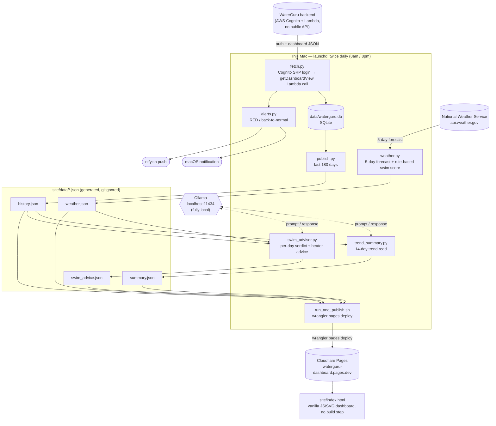

# WaterGuru Dashboard

A pipeline that pulls pool telemetry from a [WaterGuru Sense](https://waterguru.com/)
device — an internet-connected chlorine/pH/temp sensor most people only see through
WaterGuru's mobile app — stores it, and publishes it to a small static dashboard.
Twice a day it also asks a **local LLM** for a plain-English trend read and a
day-by-day swim/heater recommendation, using a real weather forecast.

**Live example:** https://waterguru-dashboard.pages.dev

**Repo:** https://github.com/billford/waterguru-dashboard (public)

---

## What it does

- **Pulls pool readings** twice a day (free chlorine, pH, water temp, skimmer flow,
  equipment health) straight from WaterGuru's backend — no official public API,
  see [Credit](#credit) below.
- **Stores history** in SQLite and charts it (chlorine, pH, temp) with target bands,
  hover tooltips, and a 7/30/90/all date filter.
- **Alerts** — a macOS notification and a phone push (via [ntfy.sh](https://ntfy.sh))
  whenever status goes RED, and again when it recovers back to normal.
- **Trend summary** — a local LLM reads the last 14 days of readings and writes
  2-3 plain-English sentences on whether things are trending up, down, or steady.
- **5-day swim forecast** — pulled from the National Weather Service, with a local
  LLM judging each day (great/good/marginal/poor) by weighing the forecast against
  the season and the pool's actual current water temp, plus a **heater lead-time
  tip** (the pool is heated, so a cool or warm stretch a few days out is worth
  adjusting for in advance).
- **A swim drill of the day** and a **shark-chase animation** on rough days, because
  a pool dashboard doesn't have to be boring.

All of it runs locally on a Mac via `launchd`, twice a day, and republishes the
static dashboard to Cloudflare Pages after every run. Nothing paid, no backend
server, no database server — just a cron-ish job, a SQLite file, and a static site.

---

## Architecture



Every arrow into `site/data/*.json` happens locally; the only outbound calls per
run are to WaterGuru, the National Weather Service, ntfy.sh (if configured), and
finally Cloudflare when publishing. The LLM calls (dashed arrows) never leave the
machine — Ollama runs on `localhost:11434`.

---

## Credit

The hard part — figuring out that WaterGuru's app talks to an AWS Cognito + Lambda
backend with no public API, and reverse-engineering the auth flow (SRP login,
identity-pool credential exchange, signed Lambda invocation) — was done by
[**Brian Wilson**](https://github.com/bdwilson) in
[bdwilson/waterguru-api](https://github.com/bdwilson/waterguru-api). `fetch.py` here
is a from-scratch rewrite of that same auth flow (no Flask/Docker, and using
[`pycognito`](https://github.com/pvizeli/pycognito) instead of the unmaintained
`warrant` library, which doesn't run on modern Python), but the credit for
discovering the API in the first place goes to that project. If you don't own a
WaterGuru, Brian's README has a referral discount link for one.

**Please don't hit the WaterGuru API more than once or twice a day.** There's no
token refresh implemented (same caveat as the original project) — every run is a
fresh login, and the API isn't meant for polling more often than that.

---

## Repo layout

```
fetch.py                     # Cognito auth + Lambda call → SQLite → triggers everything below
db.py                        # SQLite schema + row parsing
publish.py                   # SQLite → site/data/history.json
weather.py                   # NWS forecast → site/data/weather.json (+ rule-based swim score)
trend_summary.py             # local LLM → site/data/summary.json
swim_advisor.py              # local LLM → site/data/swim_advice.json
alerts.py                    # macOS notification + ntfy.sh push on RED / recovery
run_and_publish.sh           # fetch.py, then `wrangler pages deploy`
com.billfordx.waterguru-fetch.plist   # launchd schedule (8am/8pm)
site/
  index.html                 # the dashboard — vanilla JS/SVG, no build step, no CDN deps
  data/                      # generated JSON the dashboard fetches client-side (gitignored)
.env.example                 # template for WG_USER/WG_PASS/NTFY_TOPIC/WX_LAT/WX_LON
```

---

## Setup

```bash
python3 -m venv venv
./venv/bin/pip install requests requests_aws4auth boto3 pycognito
cp .env.example .env   # fill in WG_USER / WG_PASS (see below)
./venv/bin/python fetch.py
```

`.env`:

```
WG_USER=your@email.address       # same login as the WaterGuru mobile app
WG_PASS=your_waterguru_password
NTFY_TOPIC=                       # optional, see Alerting below
WX_LAT=                           # optional, for the 5-day swim forecast (US only)
WX_LON=
```

`.env` is gitignored — never commit it. So is `data/waterguru.db` and everything
under `site/data/` except `.gitkeep` (all generated, regenerated on every run). The
repo's git history has been audited and contains no real credentials — only the
`.env.example` placeholders were ever committed.

### Local LLM (Ollama)

Both the trend summary and the swim advisor need [Ollama](https://ollama.com)
installed and running locally:

```bash
ollama pull llama3.2:3b     # trend_summary.py — fast, small, plenty for summarizing numbers
ollama pull qwen2.5:32b     # swim_advisor.py — needs more judgment, see below
```

Model choice wasn't arbitrary — for the swim advisor (which has to weigh season,
temperature, and rain into a verdict *and* return strict JSON), three local models
were compared head-to-head:

| Model | Result |
|---|---|
| `llama3.2:3b` | Fast, valid JSON, but inconsistent/illogical verdicts (e.g. flagged a sunny 78°F day as worse than a stormy one) |
| `gpt-oss:20b` | Ignored the JSON output constraint entirely and returned chain-of-thought prose instead |
| `qwen2.5:32b` | **Used.** Reliable JSON every time, sane and consistent verdicts, ~30-45s per run |

Both scripts fall back gracefully if Ollama isn't running or returns something
that doesn't validate: `trend_summary.py` falls back to a rule-based sentence,
`swim_advisor.py` falls back to `weather.py`'s point-based scoring.

---

## Scheduling (twice a day)

`run_and_publish.sh` runs a fetch (which triggers alerts, weather, trend summary,
and the swim advisor) and then deploys the updated dashboard to Cloudflare Pages.
On macOS, a `launchd` agent runs it at 8am and 8pm — see
`com.billfordx.waterguru-fetch.plist`. `launchd` (vs. cron) catches a missed run
up on next wake, which matters if the machine was asleep at the scheduled time.

```bash
launchctl load ~/Library/LaunchAgents/com.billfordx.waterguru-fetch.plist
```

---

## Alerting

- **macOS notification** — always on, no setup, via `osascript`.
- **Push via [ntfy.sh](https://ntfy.sh)** — free, no account. Set `NTFY_TOPIC` in
  `.env` to any hard-to-guess string, then subscribe to that topic in the ntfy
  app. Anyone who knows the topic name can read the alerts (ntfy topics aren't
  access-controlled), so don't use something guessable.

Two things trigger an alert, each firing once on the transition (not on every
subsequent reading):

- **Water chemistry status** — RED, and again when it recovers back to normal.
  Never fires for `YELLOW`.
- **Cassette replacement** — WaterGuru reports its own `status`/`urgent` flag on
  the cassette (the consumable sensing pad), same as it does for water
  chemistry. When that flips to `RED`/urgent, you get a "replace the cassette"
  alert with the current %/days-left; a second alert fires once it's back to
  `GREEN` after replacement.

---

## Deploying the dashboard

```bash
npx wrangler login          # one-time browser auth
npx wrangler pages project create waterguru-dashboard --production-branch main
./run_and_publish.sh        # fetch + deploy
```

The dashboard reads `site/data/*.json` client-side — there's no backend, just
static files that get overwritten and redeployed on each fetch. Deployment is a
direct `wrangler pages deploy` (no GitHub↔Cloudflare app integration), which is
why the GitHub repo can be public while the deploy step still just needs a
Cloudflare account and API auth, nothing shared with GitHub.

**Note on privacy:** the `pages.dev` URL is unlisted but not access-controlled —
anyone with the link can see pool status and history. That's an accepted
trade-off here; Cloudflare Access can gate it behind a login if that changes.
