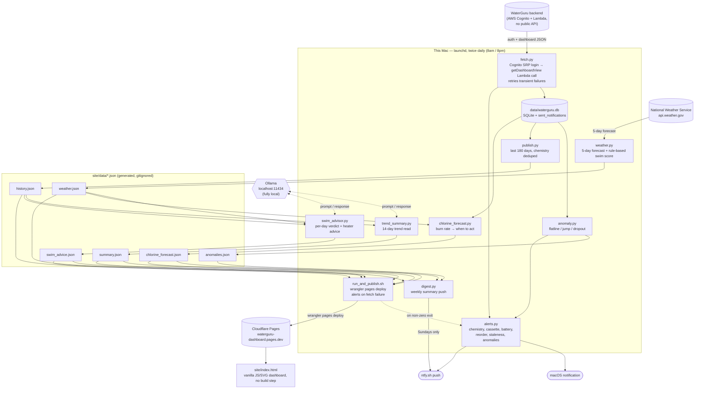

# WaterGuru Dashboard

A pipeline that pulls pool telemetry from a [WaterGuru Sense](https://waterguru.com/)
device — an internet-connected chlorine/pH/temp sensor most people only see through
WaterGuru's mobile app — stores it, and publishes it to a small static dashboard.
Twice a day it also asks a **local LLM** for a plain-English trend read and a
day-by-day swim/heater recommendation, using a real weather forecast.

**Live example:** https://waterguru-dashboard.pages.dev

**Repo:** https://github.com/billford/waterguru-dashboard (public)

---

## What it does

- **Pulls pool readings** twice a day (free chlorine, pH, water temp, skimmer flow,
  equipment health) straight from WaterGuru's backend — no official public API,
  see [Credit](#credit) below.
- **Stores history** in SQLite and charts it (chlorine, pH, temp, skimmer flow) with
  target bands, hover tooltips, and a 7/30/90/all date filter.
- **Chlorine outlook** — projects free chlorine forward from this pool's own measured
  burn rate and the temperature forecast, to answer the question the raw number
  doesn't: *do I need to do anything this week?* See
  [Chlorine outlook](#chlorine-outlook) below.
- **Alerts** — a macOS notification and a phone push (via [ntfy.sh](https://ntfy.sh))
  on water chemistry going RED, the cassette or battery needing replacement, a
  reorder reminder with enough lead time to actually order one, a stalled pipeline
  or a silent sensor, and sensor readings that look untrustworthy.
- **Weekly digest** — one Sunday push summarizing the week ahead, so a healthy pool
  isn't indistinguishable from a broken pipeline.
- **Trend summary** — a local LLM reads the last 14 days of readings and writes
  2-3 plain-English sentences on whether things are trending up, down, or steady.
- **5-day swim forecast** — pulled from the National Weather Service, with a local
  LLM judging each day (great/good/marginal/poor) by weighing the forecast against
  the season and the pool's actual current water temp, plus a **heater lead-time
  tip** (the pool is heated, so a cool or warm stretch a few days out is worth
  adjusting for in advance).
- **A swim drill of the day** and a **shark-chase animation** on rough days, because
  a pool dashboard doesn't have to be boring.

All of it runs locally on a Mac via `launchd`, twice a day, and republishes the
static dashboard to Cloudflare Pages after every run. Nothing paid, no backend
server, no database server — just a cron-ish job, a SQLite file, and a static site.

---

## Three clocks

This tripped up the first version of the dashboard and is worth stating plainly,
because it shapes the whole data model: **the device's readings move at three
completely different rates.**

| Reading | Cadence | `cfg.validDays` |
|---|---|---|
| Water temperature | every fetch (minutes) | — |
| Free chlorine, pH, skimmer flow | ~daily | 2 |
| Alkalinity, calcium, stabilizer, hardness | ~monthly | 30 |

Since the fetch runs twice a day, several consecutive snapshots share one
`latest_measure_time` and carry byte-identical chemistry — so charting
everything against `fetched_at` drew a single chlorine measurement as three or
four separate readings, and fed the trend-summary LLM the same reading several
times over, making a flat stretch look like repeated corroboration.

So the export splits them:

- `series` — chemistry, deduped on `latest_measure_time`, timestamped with it.
  Deduping **merges fields rather than taking the last row wholesale**: an
  individual sensor can drop out mid-measurement (the flow sensor going quiet
  nulls `skimmer_flow` while everything else keeps reporting), and taking the
  last row would discard a value the earlier fetches did have.
- `temp_series` — water temperature, one point per fetch, timestamped with
  `fetched_at`.
- The slow panel rides along on the chemistry rows but keeps its own
  `panel_measure_time`, and gets its own dashboard card and its own staleness
  threshold. Judging a 30-day measurement by the 48-hour rule would report a
  perfectly healthy panel as a fault every single day.

The dashboard labels chemistry tiles with their own age for the same reason: a
three-day-old chlorine number sitting next to a live water temp otherwise reads
as equally current.

### Everything the device actually reports

The original pipeline stored three of the seven chemistry values. It now keeps
all of them — total alkalinity, calcium hardness, cyanuric acid (stabilizer) and
total hardness were being parsed straight past and discarded. Stabilizer in
particular turned out to matter well beyond its own tile: it's the main control
on how fast sunlight destroys chlorine, and the forecast now uses it.

Alerts also carry `advice.action.summary` — WaterGuru works out the actual dose
for the pool's volume ("Add 73 cups of 90% concentration calcium chloride"),
which is the genuinely actionable half of an alert and was being dropped. It now
appears in the push and on the dashboard.

---

## Architecture


```mermaid
flowchart TD
    WG[("WaterGuru backend<br/>(AWS Cognito + Lambda,<br/>no public API)")]
    NWS[("National Weather Service<br/>api.weather.gov")]
    OLLAMA{{"Ollama<br/>localhost:11434<br/>(fully local)"}}

    subgraph Mac["This Mac — launchd, twice daily (8am / 8pm)"]
        FETCH["fetch.py<br/>Cognito SRP login → getDashboardView Lambda call<br/>retries transient failures"]
        DB[("data/waterguru.db<br/>SQLite + sent_notifications")]
        PUBLISH["publish.py<br/>last 180 days, chemistry deduped"]
        WEATHER["weather.py<br/>5-day forecast + rule-based swim score"]
        TREND["trend_summary.py<br/>14-day trend read"]
        ADVISOR["swim_advisor.py<br/>per-day verdict + heater advice"]
        CLFC["chlorine_forecast.py<br/>burn rate → when to act"]
        ANOM["anomaly.py<br/>flatline / jump / dropout"]
        ALERTS["alerts.py<br/>chemistry, cassette, battery,<br/>reorder, staleness, anomalies"]
        DIGEST["digest.py<br/>weekly summary push"]
        DEPLOY["run_and_publish.sh<br/>wrangler pages deploy<br/>alerts on fetch failure"]
    end

    subgraph SiteData["site/data/*.json (generated, gitignored)"]
        HIST[history.json]
        SUMM[summary.json]
        WX[weather.json]
        ADV[swim_advice.json]
        CLJ[chlorine_forecast.json]
        ANJ[anomalies.json]
    end

    CF[("Cloudflare Pages<br/>waterguru-dashboard.pages.dev")]
    SITE["site/index.html<br/>vanilla JS/SVG dashboard, no build step"]
    MACOS(["macOS notification"])
    NTFY(["ntfy.sh push"])

    WG -->|"auth + dashboard JSON"| FETCH
    FETCH --> DB
    FETCH --> ALERTS
    DB --> ANOM --> ANJ
    ANOM --> ALERTS
    ALERTS --> MACOS
    ALERTS --> NTFY
    DEPLOY -.->|"on non-zero exit"| ALERTS
    DB --> PUBLISH --> HIST
    NWS -->|"5-day forecast"| WEATHER --> WX
    HIST --> TREND
    OLLAMA <-.->|"prompt / response"| TREND --> SUMM
    WX --> ADVISOR
    HIST --> ADVISOR
    OLLAMA <-.->|"prompt / response"| ADVISOR --> ADV
    DB --> CLFC
    WX --> CLFC --> CLJ
    SUMM --> DIGEST
    CLJ --> DIGEST
    ADV --> DIGEST
    DIGEST -->|"Sundays only"| NTFY
    HIST --> DEPLOY
    SUMM --> DEPLOY
    WX --> DEPLOY
    ADV --> DEPLOY
    CLJ --> DEPLOY
    ANJ --> DEPLOY
    DEPLOY -->|"wrangler pages deploy"| CF
    CF --> SITE
```

Every arrow into `site/data/*.json` happens locally; the only outbound calls per
run are to WaterGuru, the National Weather Service, ntfy.sh (if configured), and
finally Cloudflare when publishing. The LLM calls (dashed arrows) never leave the
machine — Ollama runs on `localhost:11434`.

---

## Credit

The hard part — figuring out that WaterGuru's app talks to an AWS Cognito + Lambda
backend with no public API, and reverse-engineering the auth flow (SRP login,
identity-pool credential exchange, signed Lambda invocation) — was done by
[**Brian Wilson**](https://github.com/bdwilson) in
[bdwilson/waterguru-api](https://github.com/bdwilson/waterguru-api). `fetch.py` here
is a from-scratch rewrite of that same auth flow (no Flask/Docker, and using
[`pycognito`](https://github.com/pvizeli/pycognito) instead of the unmaintained
`warrant` library, which doesn't run on modern Python), but the credit for
discovering the API in the first place goes to that project. If you don't own a
WaterGuru, Brian's README has a referral discount link for one.

**Please don't hit the WaterGuru API more than once or twice a day.** There's no
token refresh implemented (same caveat as the original project) — every run is a
fresh login, and the API isn't meant for polling more often than that.

`fetch.py` retries a failed fetch up to three times with long backoffs, so a
dropped connection doesn't cost a whole 12-hour slot. Retries are deliberately
scoped: wrong credentials, or any other 4xx, fail immediately rather than
retrying, since three attempts on a bad password is three failed logins against
your account and not a recovery.

---

## Repo layout

```
fetch.py                     # Cognito auth + Lambda call → SQLite → triggers everything below
db.py                        # SQLite schema, row parsing, measurement dedupe, notification state
publish.py                   # SQLite → site/data/history.json
freshness.py                 # data-age math: stalled pipeline vs. silent sensor
consumables.py               # cassette/battery runway + reorder lead times
anomaly.py                   # sensor-health checks → site/data/anomalies.json
trust.py                     # is a reading believable? circulation checks + manual verdicts
annotate.py                  # CLI to mark a measurement suspect or trusted by hand
annotations.json             # hand-recorded verdicts (committed - a record of the pool)
chlorine_forecast.py         # burn-rate fit + projection → site/data/chlorine_forecast.json
weather.py                   # NWS forecast → site/data/weather.json (+ rule-based swim score)
trend_summary.py             # local LLM → site/data/summary.json
swim_advisor.py              # local LLM → site/data/swim_advice.json
alerts.py                    # macOS notification + ntfy.sh push; also the fetch-failure CLI
digest.py                    # weekly summary push
run_and_publish.sh           # fetch.py, then `wrangler pages deploy`; alerts if the fetch dies
com.billfordx.waterguru-fetch.plist   # launchd schedule (8am/8pm)
tests/                       # pytest suite, no network or database access required
site/
  index.html                 # the dashboard — vanilla JS/SVG, no build step, no CDN deps
  about-ai.html              # what's LLM-generated, what's plain arithmetic, and why
  data/                      # generated JSON the dashboard fetches client-side (gitignored)
requirements.txt             # pinned runtime deps
requirements-dev.txt         # the above plus pytest
.env.example                 # template for WG_USER/WG_PASS/NTFY_TOPIC/WX_LAT/WX_LON
```

---

## Setup

```bash
python3 -m venv venv
./venv/bin/pip install -r requirements.txt
cp .env.example .env   # fill in WG_USER / WG_PASS (see below)
./venv/bin/python fetch.py
```

Dependencies are pinned — `boto3`/`botocore` especially, since the Cognito SRP
and signed-Lambda flow in `fetch.py` leans on internals that have shifted
between releases before.

### Tests

```bash
./venv/bin/pip install -r requirements-dev.txt
./venv/bin/pytest
```

The suite covers the fiddly parts: measurement deduping, the alert transition
and once-only logic, burn-rate fitting and projection anchoring, the anomaly
thresholds, retry-vs-fail-fast on the fetch, and the WaterGuru payload parsing.
It touches no network and no real database — each test gets a throwaway SQLite
file, and notification channels are stubbed, so running it can't push to your
phone.

`.env`:

```
WG_USER=your@email.address       # same login as the WaterGuru mobile app
WG_PASS=your_waterguru_password
NTFY_TOPIC=                       # optional, see Alerting below
WX_LAT=                           # optional, for the 5-day swim forecast (US only)
WX_LON=
```

`.env` is gitignored — never commit it. So is `data/waterguru.db` and everything
under `site/data/` except `.gitkeep` (all generated, regenerated on every run). The
repo's git history has been audited and contains no real credentials — only the
`.env.example` placeholders were ever committed.

### Local LLM (Ollama)

Both the trend summary and the swim advisor need [Ollama](https://ollama.com)
installed and running locally:

```bash
ollama pull llama3.2:3b     # trend_summary.py — fast, small, plenty for summarizing numbers
ollama pull qwen2.5:32b     # swim_advisor.py — needs more judgment, see below
```

Model choice wasn't arbitrary — for the swim advisor (which has to weigh season,
temperature, and rain into a verdict *and* return strict JSON), three local models
were compared head-to-head:

| Model | Result |
|---|---|
| `llama3.2:3b` | Fast, valid JSON, but inconsistent/illogical verdicts (e.g. flagged a sunny 78°F day as worse than a stormy one) |
| `gpt-oss:20b` | Ignored the JSON output constraint entirely and returned chain-of-thought prose instead |
| `qwen2.5:32b` | **Used.** Reliable JSON every time, sane and consistent verdicts, ~30-45s per run |

Both scripts fall back gracefully if Ollama isn't running or returns something
that doesn't validate: `trend_summary.py` falls back to a rule-based sentence,
`swim_advisor.py` falls back to `weather.py`'s point-based scoring.

### The model isn't asked questions the data can't answer

`trend_summary.py` won't call the LLM at all with fewer than three distinct
measurements. The prompt demands a verdict on whether things are trending up,
down, or steady, and a small model handed one reading will manufacture one to
comply — handed a single `9.8 ppm / 7.3 pH` reading, `llama3.2:3b` reported a
chlorine drop to "approximately 3.5" and a pH shift to 6.9. Neither happened.

This was invisible until chemistry deduping landed: seven duplicate rows of one
measurement had accidentally read as a legitimate "holding steady". Below the
threshold the dashboard now reports the current numbers and states plainly that
there isn't enough history to call a trend — which is the honest answer, and the
one a pool owner can actually act on.

---

## Scheduling (twice a day)

`run_and_publish.sh` runs a fetch (which triggers alerts, weather, trend summary,
and the swim advisor) and then deploys the updated dashboard to Cloudflare Pages.
On macOS, a `launchd` agent runs it at 8am and 8pm — see
`com.billfordx.waterguru-fetch.plist`. `launchd` (vs. cron) catches a missed run
up on next wake, which matters if the machine was asleep at the scheduled time.

```bash
launchctl load ~/Library/LaunchAgents/com.billfordx.waterguru-fetch.plist
```

---

## Alerting

- **macOS notification** — always on, no setup, via `osascript`.
- **Push via [ntfy.sh](https://ntfy.sh)** — free, no account. Set `NTFY_TOPIC` in
  `.env` to any hard-to-guess string, then subscribe to that topic in the ntfy
  app. Anyone who knows the topic name can read the alerts (ntfy topics aren't
  access-controlled), so don't use something guessable.

Alerts come in two shapes, and the difference is what keeps them from becoming
noise you learn to ignore.

**Transitions** fire on the edge and go quiet while the condition persists,
comparing against the previous snapshot. No stored state needed.

- **Water chemistry status** — RED, and again when it recovers. Never `YELLOW`.
- **Cassette replacement** — WaterGuru reports its own `status`/`urgent` flag on
  the cassette (the consumable sensing pad). When it flips to `RED`/urgent you
  get a "replace the cassette" alert with the current %/days-left, and a second
  once it's back to `GREEN`.
- **Pod battery** — the same treatment. The battery level was already being
  stored but nothing ever watched it.

**Standing conditions** have no edge to hang off — left alone they'd re-fire
every run forever — so they're recorded in a `sent_notifications` table and
suppressed until the situation actually resets.

- **Reorder reminders** — `days_left` turned into "order one now" while there's
  still time for it to arrive. Fires once per depletion cycle: putting in a new
  cassette makes its level jump, which clears the record and re-arms the
  reminder for next time, rather than it being a one-time-ever event.
- **Stalled pipeline** — if `fetch.py` exits non-zero, `run_and_publish.sh`
  catches it and pushes. This is the one alert that can't come from the data,
  because the failure *is* the absence of data. Without it a broken pipeline
  looks exactly like a calm pool: the dashboard just keeps serving whatever it
  published last.
- **Silent sensor** — the sneakier version: fetches succeed, WaterGuru answers,
  but `latest_measure_time` stops advancing. A dead cassette, a flat battery, or
  a pod knocked out of the skimmer. **Suppressed during setup**: after
  installation a Sense spends 36 hours (72 scans × 30 min) watching for flow to
  learn when the pump runs, before it will schedule daily measurements. Taking
  no readings in that window is correct behaviour, and alerting through it cries
  wolf on every new install — at exactly the moment an owner is least able to
  tell a real fault from normal setup. The guard checks both the device's own
  `pumpScanState` and the time since `setUpTime`, since either alone can
  mislead.
- **Sensor anomalies** — see below.

The softer standing conditions re-arm weekly, so a real problem resurfaces
instead of being permanently muted by one dismissed notification.

---

## Chlorine outlook

The dashboard could always tell you chlorine was 9.8 ppm against a 3.0 target.
What it couldn't tell you is the thing you act on: whether to reach for the
chlorine this week, or wait.

`chlorine_forecast.py` fits a burn rate from the pool's own history. Between
consecutive measurements chlorine only falls on its own, so any *increase* means
someone added some — those stretches are discarded rather than averaged in. The
remaining declines give a ppm/day rate, and the median is taken so one bad
reading can't drag the model. Each rate is normalized to a reference 80°F before
pooling and re-scaled per forecast day against the NWS temperatures, because
chlorine burns faster in heat and sun.

Two details that matter more than they sound:

- **The projection starts today, not at the last measurement.** The cassette
  measures roughly daily, so the newest reading is usually already a day or two
  old. Decay is walked forward from the measurement so the arithmetic stays
  continuous, then trimmed to today onward — projecting into days that have
  already happened isn't a forecast. When the reading is stale the headline
  leads with the *estimate* ("last measured 9.8 ppm 2 days ago; estimated 5.6
  ppm now"), because the number on the sensor isn't the number in the pool.
- **With too little history it says so.** Under three usable declines it falls
  back to a generic outdoor-pool loss rate and the card marks itself
  low-confidence, rather than presenting a guess in the same voice as a
  measurement.

**Stabilizer is modelled too.** Cyanuric acid is the single biggest control on
how fast sunlight destroys chlorine — an unstabilized pool in summer sun can
lose most of its free chlorine in a day, while 30–50 ppm slows that dramatically
— and the device reports it on the monthly panel. Both adjustments are applied
the same careful way: segments are *divided* by their temperature and CYA
factors before being pooled, then the baseline is *multiplied* by the projected
day's factors. That normalization is what stops the model double-counting, since
a rate fitted from a hot, unstabilized week already has that burn baked in. It
also means the projection responds correctly when conditions change: add
stabilizer, and the same fitted history projects a slower burn.

When stabilizer is low, the card says so directly, because the intuitive
response to chlorine vanishing is to add more chlorine — which treats the
symptom while sunlight keeps destroying it as fast as it goes in.

**"In range" means what the device means.** WaterGuru ships the band it actually
judges chlorine against (green 1.6–5.4 ppm around a 3.0 target), so that's what
gets stored and used. An earlier version compared against target ±35%, which
called a perfectly green 5.2 ppm reading "high".

Both models are approximations — rate-per-10-degrees for heat, coarse bands for
stabilizer. They don't model UV index or bather load. It's a trend projection,
not a chemistry calculator, and the dashboard says as much.

---

## Whether a reading should be believed

A sensor reading can be precise and still be wrong about the pool.

The case this exists for: the pump failed, water sat stagnant in the skimmer and
plumbing for 48 hours, and the pod measured minutes after flow was restored. It
reported calcium hardness 153 ppm and stabilizer 10 ppm — a hand test with a kit
came back in range across the board. The device was measuring the water in the
pipe, not the water in the pool.

That single reading drove a RED status, the chlorine burn-rate fit, the trend
summary, and — worst — a dose recommendation of **73 cups of calcium chloride
into 20,000 gallons**. Chemistry advice derived from an unrepresentative sample
is the most expensive thing this pipeline can produce, so measurements now carry
a trust verdict, and untrusted ones are kept out of anything that models or
recommends.

**Automatic.** WaterGuru reports how long the flow sensor has been silent ("No
flow sensor report: 48 hours"). A measurement landing at the end of an outage
longer than `STAGNANT_HOURS` is sampling water that hasn't circulated, so it's
flagged. The signal comes from the device's own alert rather than being inferred
from gaps in our data.

**Manual**, via `annotate.py` — for everything a rule can't see:

```bash
python annotate.py list
python annotate.py suspect 2026-08-05T21:10 --note "pump was dead, hand test in range"
python annotate.py trust 2026-08-06T20:56
python annotate.py clear 2026-08-05T21:10
```

Timestamps match by prefix, so `2026-08-05T21:10` finds
`2026-08-05T21:10:04.000Z`. Verdicts live in `annotations.json` (committed — it's
a record of what happened to the pool, not generated output). **A hand verdict
always beats the automatic one:** someone standing at the pool with a test kit
outranks a heuristic.

An untrusted measurement is dropped from the burn-rate fit and the trend
summary, banner-flagged on the dashboard with its affected tiles dimmed, and any
dose recommendation derived from it gets a "confirm with a test kit before
adding anything" warning attached to the push. If *every* recent reading is
untrusted, the forecast reports that it has nothing dependable to project from
rather than projecting anyway.

---

## Sensor health

WaterGuru's status flags answer "is the water OK?". They don't answer "is the
*sensor* OK?", and a pod that fails quietly is worse than one that fails loudly
— the dashboard stays green and you stop looking at it.

`anomaly.py` runs three checks over deduped measurements:

- **Flatline** — the same value to the decimal across five distinct
  measurements. Real pool chemistry drifts; identical readings suggest a spent
  cassette pad or a cached value, not a miraculously stable pool.
- **Implausible jump** — a change larger than the chemistry can move in the
  elapsed time. The bound scales with the gap between readings, and is looser
  for chlorine than pH, since shocking a pool really does swing chlorine hard
  while pH is buffered by total alkalinity and moves slowly.
- **Dropout** — a channel that used to report and has gone null for three
  measurements running, which is how a partially failed cassette looks.

---

## Weekly digest

Alerts only fire on problems, which means a healthy pool is silent — and a
silent pipeline is indistinguishable from a broken one until you go looking.

`digest.py` sends one push on Sunday mornings: the trend summary, the chlorine
outlook, the best swim days ahead, and how much cassette and battery runway is
left. It assembles from the JSON the rest of the run already wrote, so it
reflects exactly what the dashboard shows, and it's keyed by ISO week — a
catch-up run after a sleeping Mac won't send a second copy.

It needs `NTFY_TOPIC` set to reach your phone; without it the digest still fires
as a local macOS notification. To preview one without waiting for Sunday:

```bash
./venv/bin/python digest.py --force
```

---

## Deploying the dashboard

```bash
npx wrangler login          # one-time browser auth
npx wrangler pages project create waterguru-dashboard --production-branch main
./run_and_publish.sh        # fetch + deploy
```

The dashboard reads `site/data/*.json` client-side — there's no backend, just
static files that get overwritten and redeployed on each fetch. Deployment is a
direct `wrangler pages deploy` (no GitHub↔Cloudflare app integration), which is
why the GitHub repo can be public while the deploy step still just needs a
Cloudflare account and API auth, nothing shared with GitHub.

**Note on privacy:** the `pages.dev` URL is unlisted but not access-controlled —
anyone with the link can see pool status and history. That's an accepted
trade-off here; Cloudflare Access can gate it behind a login if that changes.
